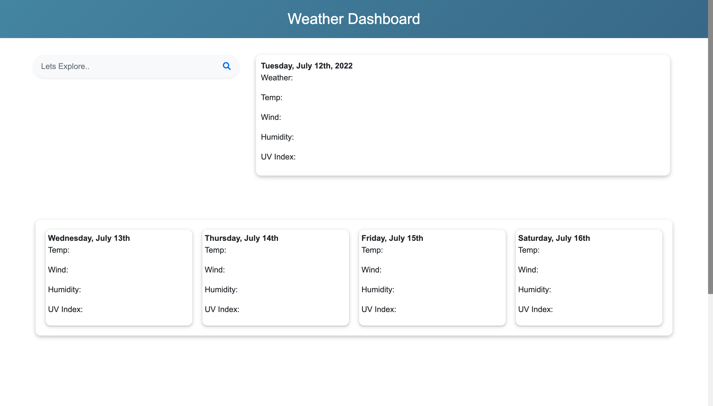

# Weather-Dashboard
During this challenge we had to use OpenWeather One Call API to retrieve weather data for cities! during this time we also had project week and I had a short time to complete this so the functionality isnt complete (yet!) but will be working towards completing this as using third party apis will be important knowledge. 

Deployed URL: [Weather-Dashboard]

Github Repo URL: [Weather-Repo]

[Weather-Dashboard]: https://cesar-infante.github.io/Weather-Dashboard/

[Weather-Repo]: https://github.com/Cesar-Infante/Weather-Dashboard

