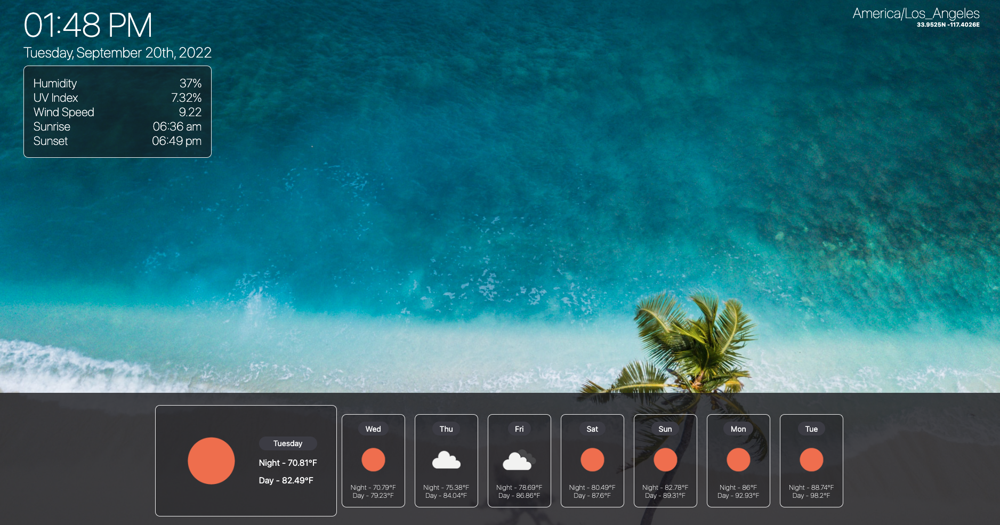

# Weather-Dashboard

A weather dashboard powered by [OpenWeather One Call API](https://openweathermap.org/api/one-call-api). Displaying the current weather, along with displaying a 7-day forecast! Using geolocation it gets your current location weather, and time zone. The current temperature is displayed in Fahrenheit. The application is responsive throughout all screen sizes with an interesting take for mobile! 

Deployed URL: [Weather-Dashboard]

Github Repo URL: [Weather-Repo]

[Weather-Dashboard]: https://cesar-infante.github.io/Weather-Dashboard/

[Weather-Repo]: https://github.com/Cesar-Infante/Weather-Dashboard

## Questions
If you have any questions, please contact me below: 

Github: [Cesar-Infante](https://github.com/Cesar-Infante) 

Email: cesar261110@gmail.com

